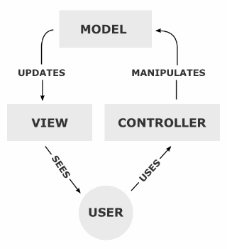
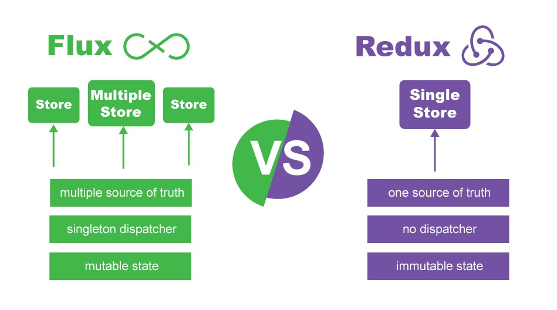

## Intro

디자인 패턴(Design Pattern)이라는 단어를 처음 접했을 때, 굉장히 부정적이었다.

"아니, 코딩하는 것도 바빠죽겠는데 미술(디자인)도 하라고? 개발자가 만능인 줄 아나!"

돌이켜보면 이 생각은 반은 맞고 반은 틀렸다. ~~디자인 패턴과 미술은 관련이 크게 없지만, 개발자는 만능이 맞다.~~

리액트 팀에서는 매주 Tech Talk를 진행한다.

이번 6월의 세 번째 Tech Talk 주제는 "React의 디자인 패턴"이었고, 나는 갑작스러운 개인적인 사정으로 참여하지 못했지만 재밌는 얘기가 오갔던 것 같아서 글을 써보려고 한다.

## 배경

디자인 패턴이라는 개념은 어디서 나왔을까?

물론 건축에서 사용하던 용어이긴 한데, 소프트웨어 공학 측면에서는 그 의미가 꽤 다르다.

이는 객체지향 프로그래밍(OOP)으로 거슬러 올라간다.

객체지향 프로그래밍은 프로그램을 유연하고 변경이 용이하게 만들기 때문에 대규모 개발에 사용되고는 했다.

그런데 객체지향 프로그래밍이라고 해도 소프트웨어의 규모가 매우 커지게 되면 새로운 기능을 하나 추가하는 데에 엄청난 노력과 시간이 필요하게 된다. 이는 아무리 주석을 열심히 달아도 주석이 책 한 권 분량이라면 쉽지 않을 것이다. ~~그래도 주석을 다는 것은 매우 중요하다.~~

따라서 통신의 프로토콜(Protocol)처럼, 프로그래밍의 형식을 정하는 일종의 약속이 필요했는데, 그것이 소프트웨어의 디자인 패턴이다.

디자인 패턴의 개념은 1990년대에 네 명의 컴퓨터 공학자가 한 권의 책을 내면서 유명해지기 시작했는데, 책 제목은 따로 있으나 사람들은 저자인 4인방을 가리켜 GoF(Gang of Fours)로 부르곤 한다.

그 이후로 소프트웨어를 개발할 때 맞닥뜨리는 다양한 문제를 해결하기 위해 엄청나게 많은 디자인 패턴들이 나왔고, 우리는 골머리를 앓으며 디자인 패턴을 설계할 필요 없이 "아, 이거 그냥 ~~패턴으로 하면 되겠네요"하고 그대로 설계할 수 있게 되었다.

디자인 패턴에도 다양한 종류가 있는데, 오늘 소개할 리액트에서 사용할 수 있는 디자인 패턴들은 대부분 각각의 역할을 나눠 코드를 관리해 유지보수와 개발 효율을 좋게 하는 아키텍쳐 패턴이라고 할 수 있겠다.

## MVC: Model-View-Controller

가장 잘 알려진 디자인 패턴이다. 어쩌면 단순하기 때문에 더 보편적으로 많이 사용되는 것일지도 모르겠다.

말 그대로 Model과 View와 Controller가 존재하며, 각자 자신만의 임무가 있어 임무를 충실히 수행한다.

Model은 데이터 그 자체 또는 데이터를 가공하는 컴포넌트를 포함한다. 다만 이 데이터를 사용자에게 보여주는 것은 View의 역할이기 때문에 Model은 어떻게 보여줄지 고민조차 하면 안된다. 오로지 데이터를 어떻게 처리할 것인가에만 집중하고, 데이터가 변경될 때 View 또는 Controller에게 이를 알려준다.

View는 Model로부터 데이터를 받아서 UI로써 사용자에게 보여준다. 데이터는 Model에게 직접 받거나, Controller를 통해 받을 수도 있다. 말장난스럽지만 원칙상 View는 Model이 갖고 있는 데이터를 가지고 있어도, 2차 가공을 해도 안되고, Model의 데이터를 그대로 보여줘야 한다.

Controller는 Model과 View의 중재자 역할로, 사용자의 동작에 따라 Model에 필요한 데이터를 요청하고, 그 데이터를 View에 반영해 사용자에게 보여준다.

글만 봐서는 이해하기 어려울 수 있어 [생활코딩](https://opentutorials.org/course/697/3828)에 있는 자료를 가져와 보았다.

{: width="70%"}
*MVC Pattern의 개념도 [출처: 생활코딩]*

생활코딩에서는 다음과 같이 위 개념도를 웹에 적용해 풀어서 설명한다.

>1. 사용자가 웹사이트에 접속한다. (Uses)
>2. Controller는 사용자가 요청한 웹페이지를 서비스하기 위해서 모델을 호출한다. (Manipulates)
>3. 모델은 데이터베이스나 파일과 같은 데이터 소스를 제어한 후에 그 결과를 return한다.
>4. Controller는 Model이 리턴한 결과를 View에 반영한다. (Updates)
>5. 데이터가 반영된 View는 사용자에게 보여진다. (Sees)

이러한 MVC Pattern은 여러 Model이 하나의 Controller에, 여러 View가 하나의 Model에, 여러 Model이 하나의 View에 연결되는 것을 허용하는데, 이것 때문에 소프트웨어의 규모가 커지게 되면 구조가 얽히고설켜 데이터 흐름의 복잡도가 무지막지하게 늘어나게 되어 성능에 안좋은 영향을 미치게 된다. 더 큰 문제는 하나의 Model에서 바뀐 데이터를 반영하기 위해 수많은 View와 그와 연결된 또다른 Model들로 무차별적으로 퍼져나갈 때 무슨 일이 일어날 지 모른다는 것이다.

갑작스러운 예시지만, Facebook에서 Facebook을 개발하는 데에는 대규모의 시스템이 필요했고, 위와 같은 이유로 MVC는 적합하지 않았다. MVC에서 파생된 MVP(Presenter), MVVM(View Model) Pattern도 있었으나, 소위 MV* 패턴이라고 불리는 이 패턴들은 개발자의 시점에서 각 요소들의 범위가 애매할뿐더러 위와 같은 문제를 본질적으로 해결하지 못했고, Facebook은 아예 이 문제를 React와 함께 Flux라는 디자인 패턴을 만들어 해결하게 된다.

## Flux

Facebook이 MVC Pattern에서 가장 골칫거리라고 생각한 것은 양방향 데이터 바인딩이었다.

데이터 바인딩이란, 화면에 보이는 데이터와 브라우저 메모리에 있는 데이터를 일치시키는 기법인데, MVC를 예로 들자면 View와 Model이 그 대상이 되겠다.

사실 말만 그럴싸하게 바뀌었을 뿐 앞에서 언급했던 이야기와 같은 맥락인데, View에서 보여주는 데이터는 반드시 Model에 있는 데이터와 일치해야 하고, 사용자가 View를 통해 입력한 값이 Model에 즉각 반영되어 서로 일치해야 한다. 이것이 양방향 데이터 바인딩이고, 규모가 커지면 요소끼리의 의존성과 관련된 문제가 생긴다.

반대로, 단방향 데이터 바인딩은 사용자의 입력값이 실시간이 아닌 특정 Event를 통해서 Model에 반영하게 된다.

페이스북은 MVC의 양방향 데이터 바인딩으로 인한 예측하기 어려운 버그를 막기 힘들어 Action이라는 Event를 이용해 단방향 데이터 바인딩을 사용하는 Flux라는 디자인 패턴을 직접 만들었다.


*Flux Pattern의 흐름도 [출처: Facebook]*


*Flux Pattern의 자세한 흐름도 [출처: Facebook]*

위의 두 그림을 보면 Flux는 MVC만큼 간단해 보이면서도 뭔가 많이 달라 보이는데 데이터 흐름이 View에서 Store에 직접 접근할 수 없는 단방향으로 바뀌고 용어가 살짝 바뀌었을 뿐 MVC와 로직이 비슷하다.

Model과 Controller가 없어진 대신, 새롭게 추가된 Dispatcher가 Action을 관리하고, Store가 상태를 관리하는 저장소 역할을 한다.

Flux의 데이터 흐름에 대한 로직은 다음과 같다.

>1. View가 Action 생성자에게 Action을 준비해달라고 부탁한다.
>2. Action 생성자는 Action을 만들어 Dispatcher에게 넘겨준다.
>3. Dispatcher는 들어온 Action의 순서에 따라 알맞은 Store로 보낸다.
>   (각 Store는 모든 Action을 받지만 필요한 Action만을 골라서 상태를 필요에 맞게 변경한다.)
>4. 상태 변경이 완료되면 Store는 자신을 구독(Subscribe)하고 있는 Controller View에게 그 사실을 알린다.
>5. 연락을 받은 Controller View들은 Store에게 변경된 상태를 요청한다.
>6. Store가 새로운 상태를 넘겨주면, Controller View는 자신 아래의 모든 View에게 새로운 상태에 맞게 렌더링하라고 알린다.

여기서 Controller View라는 새로운 친구가 등장하는데, 이 친구는 말하자면 Store에서 변경된 상태를 가져와 모든 자식 View에게 분배해주는 부모 View라고 할 수 있다.

앞선 내용에서 알 수 있다시피 데이터 흐름이 단순해졌기 때문에 요소들의 의존성이 낮아지고 독립성이 높아지게 되어 기존 MVC Pattern의 단점을 보완하게 되었다.

### Flux vs Redux

React에는 Flux의 컨셉을 따르는 Redux라는 상태 관리 라이브러리가 존재하고, 널리 사용되어 왔다.

(물론, React에서는 16.3 버전 이후부터 Context API라는 상태관리 툴이 나왔지만, 이 포스팅에서는 디자인 패턴을 다루기 때문에 해당 내용은 더 다루지 않겠다.)

그러나 Redux도 Flux의 컨셉을 완벽하게 따르고 있지는 않다.

Redux에서는 Dispatcher라는 개념이 존재하지 않고, Reducer라는 함수가 Dispatcher와 Store의 기능을 일부 담당한다. 또한 Redux에서는 한 애플리케이션에 하나의 Store만 존재하며, 모든 종류의 Reducer가 이 하나의 Store에 묶여서 각 View가 자신이 필요한 Store를 Subscribe할 수 있었던 Flux와 달리 Redux는 무조건 Single Store를 통해 각 Reducer에 접근할 수 있다는 차이점이 있다. Store가 유일하게 하나만 존재하도록 설계되었기 때문에 Redux의 Store는 Singleton Pattern을 따른다고 하기도 한다.

아래 사진은 Flux와 Redux의 차이를 보여준다.


*Flux와 Redux의 차이[출처: Quora]*

## Presentational & Container Components: PC Pattern

개인적으로 추상적이지 않아 가장 단순하면서 효율적인 디자인 패턴이라고 생각한다.

MVC를 React 버전으로 압축한 패턴이라고 생각할 수도 있을 것 같다.

React에서 Component는 다양한 핵심적인 역할을 수행하는 굉장히 중요한 요소다.

그런데 여러 기능이 복합적으로 하나의 코드 파일에 길게 작성되어 있다면, 당연하게도 규모가 커질수록 가독성도 떨어지고 유지보수하기 힘들어진다.

Facebook의 개발자로 근무하면서, Redux를 직접 개발한 Dan Abramov는 Component의 재사용성과 유지보수성에 초점을 맞춰 하나의 패턴을 제시하는데, 그게 바로 PC Pattern이다.

PC Pattern에서는 하나의 Component에서 역할에 따라 Presentational Component와 Container Component로 분리한다. 전체적인 구조는 다음과 같다.


*PC Pattern의 구조 [출처: Velog]*

- Presentational Component는 앞서 소개했던 디자인 패턴들의 View처럼 사용자에게 어떻게 보여지는지를 책임지며 데이터를 관리하지 않고, 데이터를 보여주는 것은 Props를 통해 받는다. 상태 관리 역시 최소한으로 하며, 주로 데이터와 관련 없는 UI 상태이다.

- Container Component는 View를 제외한 나머지인 어떻게 동작해야 할지와 상태 관리를 책임진다. 데이터 또는 가공한 데이터를 다른 Presentational Component나 Container Component에게 제공한다. Flux Pattern에서 Action을 호출하는 작업을 Container Component에서 수행한다고 보면 된다.

앞서 언급했듯 이 패턴에서는 UI와 로직을 분리하기 때문에 코드의 가독성이 좋아지는 장점이 있다.

좀 더 개발적으로 말해보자면, Presentational Component에서는 오로지 DOM Markup과 Style에만 집중할 수 있고, Container Component에서는 UI를 제외한 데이터들의 상태 관리에 집중하기 때문에 유지보수가 용이하다고 할 수 있다.

이 패턴을 사용하는 방법은, 프로젝트에서 기존 `frontend/src/components`에 `SideBar.js`라는 컴포넌트 파일이 존재했다면 아래와 같이 나누면 된다. 물론 이것이 절대 정답이 아니며, 원래 하나였던 컴포넌트를 기능별로 분리했다는 점만 의식하면 되겠다.

```bash
components ─ SideBar ┬ index.js
                     ├ SideBarContainer.js
                     └ SideBarPresenter.js
```

그러나 아이러니하게도 PC Pattern을 처음 소개한 Dan Abramov는 현재 이 패턴을 사용하지 말라고 언급했으며, 심지어 트위터에서 이 패턴을 소개했던 것이 후회된다고까지 이야기했다고 한다. 해당 내용을 다룬 [우아한테크코스 기술 블로그](https://woowacourse.github.io/tecoble/post/2021-04-26-presentational-and-container/)의 글을 인용하자면, PC Pattern으로 얻을 수 있는 이점들은 대부분 굳이 패턴을 적용하지 않고도 상향식 개발 방식과 React Hook으로 충분히 해결할 수 있다고 했다.

여기서 우리가 얻을 수 있는 교훈은, 아무리 현재 "국룰"이라고 생각되는 디자인 패턴이 있다고 해도 미래에는 기술의 발전으로 인해 도태될 수 있다는 것이다. 따라서 하나의 패턴을 맹목적으로 따르기보다는, 이 패턴을 사용하는 이유와 그 이점을 이해하는 방향으로 나아가는 것이 급변하는 개발 트렌드에 따라갈 수 있는 방법일 것 같다.

## 마치며

그동안 나는 대용량 트래픽을 처리할 일이 없었고, 전지적 개발자 시점으로만 개발을 했었어서 딱히 디자인 패턴을 고려하지 않았었다.

이번에 React와 디자인 패턴에 대해 알아보다 보니 정말 많은 패턴들이 존재했고, 그 중 유명한 몇 개의 패턴들은 FAANG의 F를 맡고 있는 Facebook이 꽤 많이 연관되어 있었다.

전 세계에 사용자가 존재하는 Facebook에서 그만큼 디자인 패턴을 중요하게 여긴다는 것은 대규모의 데이터를 제어해야 할 때, 애플리케이션의 규모가 클 때 디자인 패턴이 더욱 효율적이라는 뜻이라고 느꼈다.

그렇다고 우리는 그들처럼 디자인 패턴을 골머리를 앓으며 새로 만들 필요는 없다.

**"바퀴를 다시 발명하지 마라"**라는 유명한 프로그래밍 격언이 있듯이, 선임 개발자들이 이미 수많은 디자인 패턴들을 만들었고 그 성능을 검증했으니 우리는 필요에 맞게 잘 가져다 쓰기만 하면 될 것 같다.

## 참고자료

1. [데이터 바인딩(단방향 바인딩, 양방향 바인딩)](https://authorkim0921.tistory.com/13)
2. [[생활코딩] MVC 디자인 패턴](https://opentutorials.org/course/697/3828)
3. [[Facebook] Flux 공식 문서](https://facebook.github.io/flux/)
4. [React의 flux 패턴](https://www.huskyhoochu.com/flux-architecture/)
5. [[Quora] Why is Redux more popular than Facebook Flux?](https://www.quora.com/unanswered/Why-is-Redux-more-popular-than-Facebook-Flux)
6. [Presentatonal and Container Components](https://medium.com/@dan_abramov/smart-and-dumb-components-7ca2f9a7c7d0)
7. [[Velog] Redux - Presentational and Container Components Pattern](https://velog.io/@jengyoung/Redux-Presentational-and-Container-Components-Pattern)
8. [presentational and container 패턴이란 무엇인가](https://woowacourse.github.io/tecoble/post/2021-04-26-presentational-and-container/)
