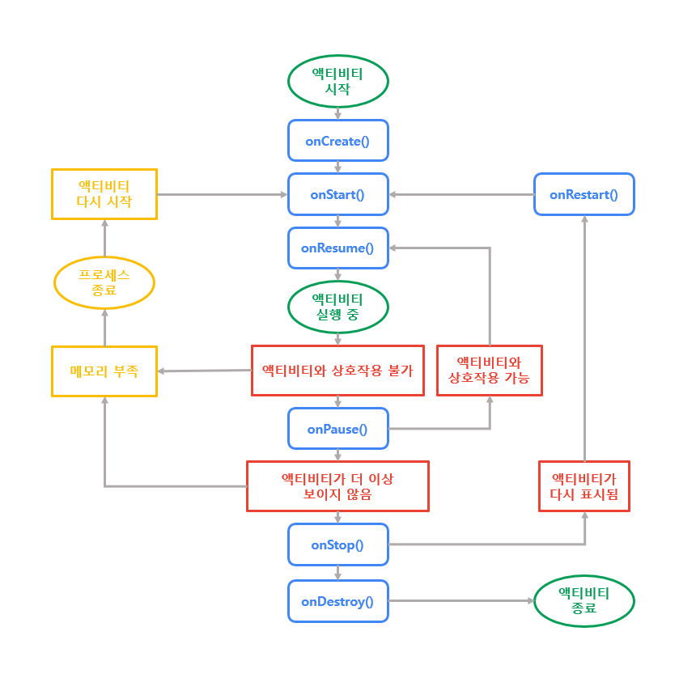
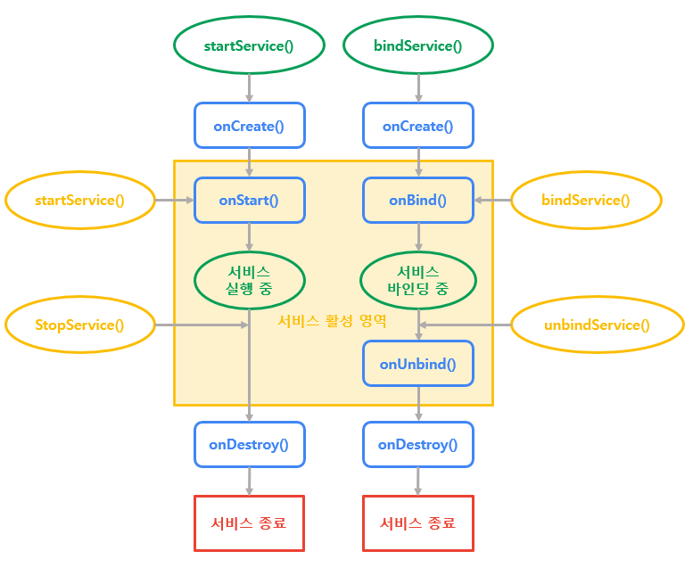

안드로이드 개발자가 Kotlin, Java, C++ 언어로 프로그램을 작성하여 apk나 Bundle 형태로 애플리케이션을 배포하게 되면 각 애플리케이션은 실행시에 각각의 애플리케이션에 필요한 **구성 요소**(Component)에 액세스하게 됩니다.

안드로이드 앱이 액세스 할 수 있는 구성요소는 크게 네 가지로 나눌 수 있으며,
이들을 **기본 4대 구성 요소**라고 부릅니다.

이 포스트에서는 안드로이드 애플리케이션의 4대 구성 요소에 대해 소개해 보겠습니다.

***

### 들어가기에 앞서

 4대 구성 요소와 더불어 추가적인 요소들을 애플리케이션에 등록하는 장소를 `manifest`라고 부르며, 안드로이드 프로젝트의 `AndroidManifest.xml`  파일로 작성합니다. 구성 요소의 호출에 사용되는 객체를 `intent`(인텐트)라고 부릅니다.

다루는 내용의 범위가 다소 넓어 코드보다는 개념 위주로 설명하였습니다.
구체적인 코드 작성에 대해서는 각 절 시작 단어에 링크된 Anroid Developer 공식 문서의 Guide 항목을 참조하시기 바랍니다.

***

## 안드로이드 애플리케이션 4대 구성 요소


*안드로이드의 4대 구성 요소*

[1.](#1--activity-액티비티) Activity (액티비티)

[2.](#2--service-서비스) Service (서비스)

[3.](#3--broadcast-receiver-브로드캐스트-리시버) BroadCast Receiver (브로드캐스트 리시버)

[4.](#4--contents-provider-콘텐츠-제공자) Contents Provider (콘텐츠 제공자)

***

### 1.  Activity (액티비티)

[액티비티](https://developer.android.com/guide/components/activities)는 애플리케이션이 사용자와 상호작용하는 UI (User Interface)입니다.


*구글 플레이 스토어의 UI*

한 **액티비티**는 한 화면을 나타내며 여러 액티비티가 모여 한 애플리케이션의 **UI를 구성**합니다. 각각의 액티비티들은 자체적인 레이아웃 파일을 가지고 독립적으로 작동하며, 애플리케이션에서는 다른 액티비티를 호출하기 위하여 인텐트 객체를 사용합니다.
액티비티는 어플리이션 UI의 기본 단위로 작동하기 때문에 애플리케이션을 실행할 때는 애플리케이션 자체가 아닌 한 액티비티를 호출하게 됩니다.

애플리케이션은 액티비티를 통해서 사용자의 입력을 받을 수 있고, 사용자의 입력에 따라 유저에 의한 애플리케이션의 흐름(User flow)을 구현하게 됩니다.

이렇게 사용자와의 상호 작용으로 사용자가 특정 작업을 처리할 때 생성한 액티비티의 집합을 **태스크**(Task)라고 하는데, 이 태스크에 속한 액티비티들은 실행된 순서에 따라 액티비티 스택으로 관리됩니다.
이 **액티비티 스택**은 액티비티라는 문서들이 들어 있는 태스크 상자를 사용자가 위에서 보는 것으로도 이해할 수 있습니다.


*액티비티 상자로 나타낸 태스크*

스택 구조는 **LIFO(후입 선출)** 구조라고도 표현하며, 나중에 생성된 액티비티는 스택 최상단에 위치하여 가장 나중에 생성된 액티비티가 사용자에게 보여지게 됩니다.

액티비티와 태스크에 대한 더 자세한 내용은 [작업 및 백스택](https://developer.android.com/guide/components/activities/tasks-and-back-stack)을 참고하시길 바랍니다.

액티비티는 액티비티의 **생명 주기**에 따라서 상태가 변화하게 됩니다.
만약 사용자가 애플리케이션을 실행하는 도중에 전화가 걸려오거나 화면을 회전할 경우 액티비티는 중지되었다 재시작되게 됩니다. 이렇게 되면 액티비티에서 사용자가 진행중이던 작업을 잃게 되므로, 생명 주기에 따라 적절한 조치를 취해 주어야 합니다.  


*액티비티의 생명주기*  

애플리케이션이 최초로 시작되면 `onCreate()` 메소드가 호출되며 메인 액티비티가 태스크 상자의 최상단에 위치하게 됩니다. 만약 액티비티에 저장된 정보가있다면 `savedInstanceState` 객체를 통하여 불러오게 됩니다.

`onCreate()` 이후 액티비티가 사용자에게 표시되기 전에 `onStart()` 메소드가 호출되며, `onResume()` 메소드가 사용자와의 상호작용을 위해 호출됩니다. 메소드가 사용자에게 표시되기는 하지만 상호작용이 불가능할 때에는(예 : 투명한 액티비티 아래에 액티비티가 표시될 시) `onPause()` 메소드가 호출되며, 사용자에게 액티비티가 완전히 보이지 않게 되면 `onStop()` 메소드가 호출됩니다. 최종적으로는 `onDestroy()` 메소드를 호출하며 액티비티가 완전히 종료됩니다.

`Dialog`는 어떨까요?  


*TimePickerDialog* [이미지 출처: Stack OverFlow](https://stackoverflow.com/questions/35017148/timepickerdialog-custom-theme)

투명하고 어두운 화면 뒤에 원래의 액티비티가 표시되어 `onPause()`가 호출된다고 생각하기 쉽지만, 시스템은 **다이얼로그**를 사용자와 액티비티간의 상호작용으로 생각합니다. 따라서 생명 주기에 관련한 메소드는 **호출되지 않습니다**.

간단히 말해서 액티비티가 상호작용 가능한지의 여부에 따라 `onResume()` 과 `onPause()`가 결정되고 액티비티가 사용자에게 보이는지 보이지 않는지 여부에 따라서 `onStart()` 와 `onStop()` 상태가 결정됩니다.
주의할 점은 `onPause()` 상태에서 `onResume()` 상태로 복귀할 때에는 다른 상태를 거쳐가지 않지만, `onStop()` 상태에서 `onStart()` 상태로 복귀할 때에는 `onRestart()` 메소드가 호출된다는 점입니다.

예를 들어서 액티비티가 보이지 않는 상태에서 다시 호출될 때에는
`onStop() -> onRestart() -> onStart() -> onResume()` 순서로 메소드가 호출됩니다.

개발자가 생성한 액티비티는`AndroidManifest.xml` 에 `<activity>` 요소를 등록한 뒤 인텐트를 생성하여 `startActivity(Intent)` 를 통해서 호출할 수 있습니다.

***

### 2.  Service (서비스)

[서비스](https://developer.android.com/guide/components/services)는 인터페이스를 가지지 않는 채로 실행되는 구성 요소입니다.
서비스를 실행시킬 때도 인텐트가 필요합니다.


*애플리케이션을 나가도 음악은 계속 재생*

**서비스**는 주로 오래 걸리는 작업을 수행하거나, 사용자와 액티비티간의 상호 작용을 방해하지 않으며 네트워크를 통해 데이터를 받아오는 등 인터페이스를 가지지 않아도 할 수 있는 일을 수행합니다. 오래 걸리는 작업으로는 음악 재생, 타이머 실행 등이, 사용자를 방해하지 않으며 데이터를 받아오는 작업에는 메신저 앱의 새로운 대화 수신 등이 있습니다.

서비스는 크게 **백그라운드 서비스** (Background Service)와 **포어그라운드 서비스** (Foreground Service)로 나눌 수 있는데, 사용자에게 알려주지 않은 채로 실행되면 백그라운드 서비스, 알림 등을 사용해서 사용자에게 실행중임을 알리면 포어그라운드 서비스로 분류할 수 있습니다. 예시로 든 서비스 중 음악 재생은 앱을 나가도 알림창을 보여주며 음악을 재생하므로 포어그라운드 서비스로 볼 수 있고, 메신저의 대화 내용 수신은 사용자에게 알려주지 않고 지속적으로 네트워크를 통해 데이터를 수신하므로 백그라운드 서비스로 분류할 수 있습니다.

또 다른 프로세스(애플리케이션이나 서비스)에 의해 서비스가 실행될 수도 있습니다. 이는 **바인딩된 서비스**로 표현되며, 실행된 서비스는 다른 프로세스에 API를 제공하게 됩니다. 이렇게 바인딩된 서비스는 시스템이 서비스를 부른 프로세스와, 불린 프로세스 모두에게 같은 우선순위를 부여할 수 있게 합니다.

서비스를 구현하였다면 `AndroidManifest.xml` 파일에 `<service>` 요소를 등록한 뒤 `startService()` 메소드로 바인딩되지 않은 서비스를, `bindService()` 메소드로 바인딩된 서비스를 호출할 수 있게 됩니다. 호출된 서비스는 액티비티처럼 특정한 생명 주기에 따라서 동작하게 되는데, 서비스의 호출 방법에 따라 생명 주기가 약간 다릅니다.


*서비스의 생명주기*

바인딩되지 않은 서비스의 경우 최초 `startService()` 메소드 실행시 `onCreate()` 상태와 `onStartCommand()` 상태를 모두 지나게 되고, 이후 `startService()` 실행시 `onStartCommand()` 상태만을 지나게 되며, `stopService()` 메소드에 의해 서비스가 `onDestroy()` 메소드와 함께 종료됩니다.

반면 바인딩된 서비스는 `bindService()` 가 최초 실행되면 `onCreate()` 상태와 `onBind()` 상태를 지나며 서비스와 서비스를 호출한 컴포넌트(호출자 컴포넌트)가 바인딩되고, 다시 실행되면 `onBind()` 상태를 지나며 요청한 데이터를 `bindService()` 의 매개 변수인 `connection` 을 통해서 호출자 컴포넌트에 전달하게 됩니다.
서비스가 필요한 작업이 모두 종료되면 호출자 컴포넌트가 `unbindService()` 메소드를 실행하고, 이에 따라 서비스는 `UnBind()` 상태를 지나며 호출자와의 바인딩이 끊어지게 됩니다. 이후 바인딩된 컴포넌트를 잃은 서비스는 자동적으로 `onDestroy()` 메소드와 함께 종료됩니다.

***

### 3.  BroadCast Receiver (브로드캐스트 리시버)

[브로드캐스트 리시버](https://developer.android.com/guide/components/broadcasts)는 안드로이드 기기에 발생하는 여러 가지 이벤트를 수신하는 구성 요소입니다.

안드로이드 시스템은 모든 앱을 대상으로 특정 이벤트가 발생했다는것을 인텐트를 통해서 방송(BroadCast)합니다. 이벤트의 종류는 굉장히 다양합니다.


*표준 브로드캐스트*

위에 보이는 사진은 인텐트가 브로드캐스트를 보내는 이벤트의 예시입니다.
예를 들어 `ACTION_TIME_TICK` 은 매 분 송출되는 시간 변화에 대한 방송입니다. 시스템 브로드캐스트의 모든 목록을 보려면 Android SDK의 `BROADCAST_ACTIONS.TXT` 를 참조하기 바랍니다.

애플리케이션에 특정 브로드캐스트를 수신하도록 등록하여 송출되는 브로드캐스트를 수신할 수 있으며, 브로드캐스트가 수신되면 애플리케이션에서 브로드캐스트에 따라 예정해 놓은 작업을 수행하게 됩니다.

브로드캐스트 메시지는 인텐트 객체를 통해서 전달되며, 이벤트가 발생했다는 메시지와 함께 추가적인 내용이 포함되기도 합니다.
예를 들어 `android.intent.action.AIRPLANE_MODE` 는 비행기 모드에 관한 이벤트가 발생했다는 메시지를 전달하는 인텐트이며, 추가적인 정보로 비행기 모드가 켜진 것인지 꺼진 것인지를 알리는 bool 정보가 포함됩니다.

애플리케이션은 두 가지 방식으로 브로드캐스트를 수신할 수 있습니다.

1. `AndroidManifest.xml` 에 `<receiver>` 요소를 등록하여 브로드캐스트 리시버를 선언하기

    앱이 설치될 때 패키지 관리자가 브로드캐스트를 등록하게 됩니다.
    방송 수신 시 앱이 실행되고 있지 않다면 시스템이 앱을 시작하고 브로드캐스트를 전달할 수 있습니다. 애플리케이션은 ```onReceive(Context, Intent)``` 메소드에서 브로드캐스트에 따른 작업을 수행하게 되며, 이 메소드가 반환되면 구성 요소는 비활성 상태로 간주됩니다.

2. 컨텍스트에 브로드캐스트 리시버를 등록하기
    컨텍스트 (예 : 액티비티, 애플리케이션)에 등록된 브로드캐스트 리시버는 컨텍스트가 활성 상태인 동안 브로드캐스트를 수신합니다.

    ```Kotlin
    val br: BroadcastReceiver = MyBroadcastReceiver()
    val filter = IntentFilter(ConnectivityManager.CONNECTIVITY_ACTION).apply {
    addAction(Intent.ACTION_AIRPLANE_MODE_CHANGED)
    }
    registerReceiver(br, filter)
    ```

    작성된 `Kotlin` 코드와 같이 브로드캐스트 인스턴스를 생성하고 인텐트 필터를 통하여 원하는 이벤트만을 수신하는 필터를 생성한 뒤, `registerReciever(BroascastReceiver, IntentFilter)` 메소드를 통해 브로드캐스트 리시버를 등록할 수 있습니다.
    더 이상 브로드캐스트 리시버가 필요하지 않거나 컨텍스트가 비활성화되는 경우에는 `unregisterReceiver(android.content.BroadcastReceiver)` 메소드를 호출해야 불필요한 메모리 낭비를 막을 수 있습니다.

    컨텍스트의 생명 주기에 유의하여 브로드캐스트 리시버가 중복 등록되는 일이 없도록 해야 합니다.

***

### 4.  Contents Provider (콘텐츠 제공자)

[콘텐츠 제공자](https://developer.android.com/guide/topics/providers/content-providers)는 애플리케이션이 저장한 데이터를 안전하게 공유하기 위해 사용되는 구성 요소입니다. **콘텐츠 제공자**는 데이터를 캡슐화하고, 데이터 보안을 유지하기 위해 사용할 수 있습니다.
콘텐츠 제공자는 다른 구성 요소와는 다르게 **인텐트로 실행되지 않습니다**.


*콘텐츠 제공자의 개념*

대부분의 애플리케이션은 자체적인 데이터베이스를 가지고 있습니다. 이 데이터베이스에 저장된 정보를 다른 애플리케이션이 필요로 한다면, **보안성**을 유지할 수 있다는 전제 하에서 정보를 제공할 수 있습니다.

예를 들어 메신저 앱이 주소록에 등록된 연락처를 통하여 이용자의 친구를 등록하려고 할 때, 주소록이 연락처를 제공하지 않으면 굉장히 곤란할 것입니다. 그렇다고 연락처의 정보를 공개된 경로에 저장하여 공유한다면 보안성에 문제가 생길 수 있습니다. 이 때 사용되는것이 콘텐츠 제공자입니다.

다른 애플리케이션에 데이터를 제공해야 하는 경우 콘텐츠 제공자를 작성하며
`AndroidManifest.xml` 에 `<provider>` 요소를 등록하여 애플리케이션의 구성 요소로 만들 수 있습니다.

반대로 다른 앱이 지원하는 콘텐츠 제공자를 이용할 수도 있습니다. 이때 콘텐츠 제공자 객체를 얻기 위하여 사용하는 객체가 `ContentResolver` 객체입니다. `ContentResolver` 객체는 모든 앱의 콘텐츠 제공자가 등록되어 있는 객체이며, `Uri` 객체(주소를 통하여 리소스에 접근하는 객체)를 통하여 이용하고자 하는 콘텐츠 제공자에 액세스하게 됩니다.

Android는 영상,음성,이미지 등의 미디어와 연락처 등을 콘텐츠 제공자를 통하여 제공합니다. 이 콘텐츠 제공자에 대해서는 [android.provider](https://developer.android.com/reference/android/provider/package-summary)를 참고하시기 바랍니다.

***

#### 추가로

안드로이드 애플리케이션은 위에 서술한 구성 요소들을 기술한 코드와 함께 이미지, 오디오 등의 다양한 리소스를 함께 가지고 있습니다.
프로젝트에 포함된 애플리케이션 고유의 아이콘이나, 알림음, 폰트 등을 예로 들 수 있을 것입니다.

***

#### 마치며

여기까지 안드로이드 애플리케이션의 4대 기본 구성 요소에 대해서 살펴보았습니다.
애플리케이션을 처음 제작할 때는 기본 개념을 안다고 해도 이를 실제 코드로 구현하는 길에는 많은 난관이 있었습니다.

그러나 대부분의 내용들이 공식 문서에 예시로 표현되어 있고, 다른 개발자분들이 이미 구현한 예시들을 참조하면 충분히 해결할 수 있을 것입니다.
모쪼록 더 능숙한 개발자가 되어 더 전문적이고 새로운 내용을 담은 포스팅으로 돌아오도록 하겠습니다.

포스팅 읽어 주셔서 감사합니다.

***

##### 참조

[Android Developers - Application Fundamentals](https://developer.android.com/guide/components/fundamentals)

[Android Developers - Developer Guide](https://developer.android.com/guide/)
